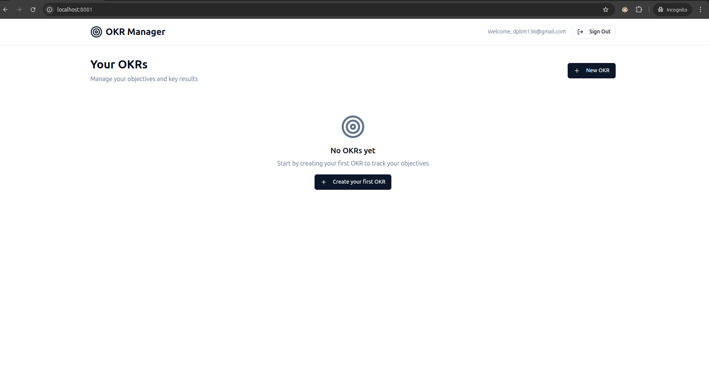

# Mentto Project

An OKR management tool for Mentto's internship test.

This project was done using:

* node
* react
* lovable
* supabase
* resend



## Usage

To start using this project, first configure your supabase instance and save your credentials inside a `.env` file, as shown here [.env.example](./.env.example).

Then, configure your resend instance and set your credentials for supabase edge functions.

then run in your terminal:

```bash
npm i
npm run dev
```

Now you're ready to start!!